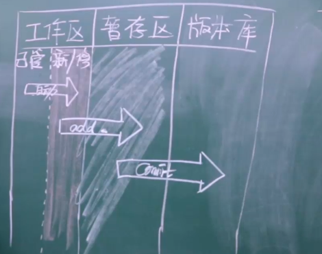

### 初始化
    git init
### 状态
    git status
### 添加
    git add 文件夹 
    git add .
### 提交
    git comit -m 文件夹
    git commit -m ''
### 工作原理

### 日志
    Git log
### 回滚
    $ git reset --hard ac504a164c29c679f05bf1ac03dcaa6d7440e0cf
    HEAD is now at ac504a1 a

### 引用日志
    git reflog 可以查看 回滚前的所有日志

### 分支
    git branch
    git branch dev 创建分支
    git checkout dev 切换分支
### 合并
    git checkout master  先切换到master 分支
    git branch bug  生成bug分支
    git commit -am '修复bug' 
    git checkout master 再切换到master
    git merge bug  Master分支 合并 bug修复代码
    git branch -d bug 删除bug 分支
    
    git merge --abort 取消合并
    
### 代码托管Github
    git remote add origin https://github.com/backcn/git_learn.git
    git push -u origin master 本地Master分支 推送到远程
    
### 远程工作原理

    
### 变基
    1.多个记录整合成1个 注：不要rebase已经push 记录
        git log 首先查看 日志
        git rebase -i HEAD xxxxxxxx 从当前位置 合并到 xxxxx
        git rebase -i HEAD~3  合并最近三条
        修改 子日志 pick => s
    2.不产生分叉
        不使用 git pull origin dev
        git fetch origin dev 
        git rebase origin/dev
     
    注意git rebase 冲突解决方案
        首先根据提示 git add .....
        git rebase --continue
        
        
    
    
    
